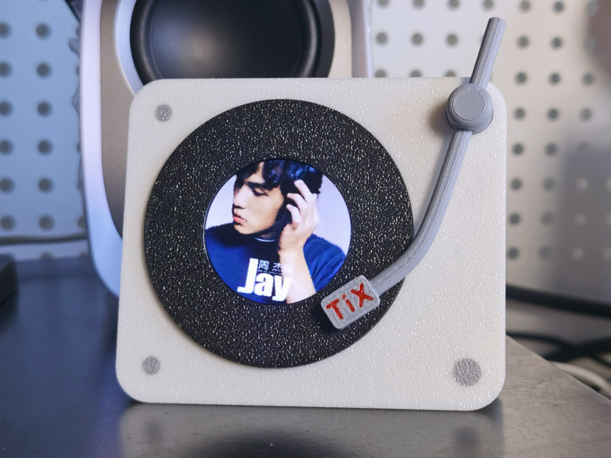

# 歌曲封面显示唱片机

## 一、项目说明

本项目对于个人学习用途者免费开放，请您遵守开源协议；  
对于商用行为，请联系作者获取授权，否则视作侵权，您可通过下方电子邮件地址联系作者：

[realticks@qq.com](mailto:realticks@qq.com)

## 二、开源与管理

本仓库负责管理本项目的单片机代码部分，所有部分开源链接如下：

* 单片机代码：
  * Github：[TiX233/song_cover_display](https://github.com/TiX233/song_cover_display)
  * Gitee：[TiX233/song_cover_display](https://gitee.com/TiX233/song_cover_display)
* 上位机：
  * Github：[TiX233/song_cover_display_upper](https://github.com/TiX233/song_cover_display_upper)
  * Gitee：[TiX233/song_cover_display_upper](https://gitee.com/TiX233/song_cover_display_upper)
* 原理图/PCB：
  * 立创开源平台：[歌曲封面显示唱片机](https://oshwhub.com/realtix/cover_display)
* 外壳：
  * MakerWorld：[@realTiX - 电脑歌曲封面显示器唱片机](https://makerworld.com.cn/zh/models/1979900-dian-nao-ge-qu-feng-mian-xian-shi-chang-pian-ji)

## 三、项目简介

这是一个用于显示电脑当前正在播放音频的封面的唱片机风格桌面摆件。  
播放状态下，唱臂会靠近唱片，且显示屏中的封面会旋转；  
暂停状态下，唱臂会离开唱片，显示屏中的画面会暂停旋转。    
通过手动拨动唱臂，可以控制电脑音频的播放与暂停。

## 四、项目原理

**全局原理：**  
上位机通过 windows [smtc](https://learn.microsoft.com/zh-cn/windows/uwp/audio-video-camera/integrate-with-systemmediatransportcontrols) 服务（win10 及以上）获取系统当前正在播放的音频的各种信息，通过 usb 向单片机发送封面和暂停/播放等信息来控制唱片机的状态；当手动拨动唱臂时，单片机会向上位机发送请求，上位机收到请求后会通过 smtc 来控制系统音频的播放或暂停状态，然后回传状态给单片机。上位机会每秒发送一次系统音频的播放状态给唱片机，在上位机超过一分钟没有发过来命令后，唱片机会进入休眠。

**唱片机部分：**  
使用一颗 `AT32F403ACCT7` 作为主控，使用一片 `GC9A01` 240\*240 圆形显示屏显示封面；  
使用两个 9\*10 带铁芯线圈来驱动唱臂，唱臂磁铁可不分极性随意安装，算法会自动识别；  
唱臂原理可参考磁保持继电器；  
使用全速 usb cdc 虚拟串口来收发上位机数据；  
开启拓展 ram，使用一个 115.2 KB 全局数组来存储图片；  
使用 50M spi dma 刷屏，设置了两个十分之一屏幕尺寸的 buffer 进行双缓冲刷屏；  
spi dma 部分非 at32 官方库，而是自己移植了 stm32 hal 库，因为 at 的 spi 库连多字节发送都没有，dma 收发也没有；  
很难不吐槽 at32 的官方库为什么不像 py32 一样直接套 st 的 hal 库，反正 bsd 协议；  
使用自研 `ltx` 裸机调度器，显示屏初始化和唱臂自检可同时运行，包括后续的运行阶段。

**[ltx](https://gitee.com/TiX233/ltx)：**  
自研裸机调度器，自数字红石项目以来的所有项目用的都是这个；  
主要由 `定时器`、`闹钟` 以及 `发布订阅机制` 三个部分组成，仅需 `ltx.c` 与 `ltx.h` 即可运行；  
ltx 提供的 `app`、`脚本`、`事件组` 等等额外拓展功能组件皆由上述三个基本组件组合而来。  

闹钟组件常用于某些事件的超时检查，最初设计用于中断按键消抖，例如某个按键中断发生后立即创建一个 20ms 后的闹钟，每次抖动都会将闹钟倒计时重置为 20ms，直到不抖动 20ms 后闹钟到时调用回调，通过设置标志位，可区分第一次边沿变化与后续抖动，提高中断按键的响应速度以及提供更优雅的消抖方案，例如 [反应力测试器项目](https://gitee.com/TiX233/reaction_tester) 可提供仅 1us 延迟的中断按键功能

发布订阅机制常用于数据采样，例如定时器设置一个 20ms 一次的发起 adc dma 采样的任务，那么在 dma 采样完成回调里发布数据更新话题即可让所有订阅者获取最新的数据，无需所有数据使用者均创建一个 20ms 的定时器任务来 poll 数据，并且通过订阅与取消订阅，可方便地对数据打印进行开关。定时器任务也是通过发布话题通知订阅者实现的，所以可以实现对某些定时器任务进行 hook 操作

脚本组件原设计用于执行特定的序列如显示屏初始化这种需要多次发送数据的固定步骤场景，  
现已丰富为类似状态机协程的存在，配合 ltx 调度器，可实现步骤间非阻塞延时以及新步骤非阻塞等待话题发布并设置等待超时时间，  
大部分场景可取代 app 组件提供的 task 这一定时轮询任务功能，  
通过设置步骤间延时为 0 tick，可实现仅出让单次调度轮询，而非出让一整个时间片（1 ms）

## 五、烧录

使用 `jlink/daplink/...` 等等 swd 调试器进行固件烧录，可使用 keil 编译烧录或其他 swd 固件烧录工具，固件在 pcb 开源页面附件有提供

## 六、调试

如果您需要对本项目进行二次开发或拓展，那么应该需要一些调试手段。

本项目没有引出串口，输入输出信息是通过 `segger RTT` 保存在一块 ram 中的，当调试器链接后，电脑用通过 `openOCD` 来对内存进行写入读出以实现输入输出，理论上，这会比串口更快，毕竟只要读写内存，而无需外设收发，并且还能保存一定的历史输出。  

如果您有 `jlink`，那么可以直接用 `segger` 提供的 `rttviewer` 进行调试，这里仅提供使用 `dap-link` 的调试方法：

1. 在雅特力官网下载官方提供的 `openocd` 版本，将其加入环境变量
2. 链接调试器和设备，打开任意 `shell`，输入 `openocd -f rtt2vofa.cfg`
   * 注：如果没有加入环境变量，那么上述命令需要输入 openocd.exe 的完整路径
3. 打开任意支持 `tcp` 的串口调试工具，这里以 `vofa+` 为例，填入如下图的配置信息
   * 
4. 链接成功后，即可查看输入输出信息

通过自定义命令，可控制单片机的运行状态，比如暂停某些 app 如 usb 等等，也可依赖发布订阅机制实现数据更新后的自动打印，在 `ltx_cmd.c` 中提供的 `/print` 命令有一个 `heart_beat` 样例，用来每秒打印心跳，您可参考该样例来设置自己的订阅数据打印；  
如果您需要经常修改一些参数如尝试某些不同的背景颜色，那么也无需重新烧录，在 `ltx_cmd.c` 中提供了一个 `/param` 命令，该命令可对 `ltx_param.c` 中指向的自定义数据进行读写；

所有的自定义命令可在 `ltx_cmd.c` 中查看，也可开机后给单片机发送 `/help` 命令来列出所有命令，您也可以参考这些命令创建一些方便调试自定义命令，以下是目前所有的自定义命令，部分命令可能会影响系统的正常运行：

| 命令 | 作用 |
|-|-|
| `echo` | 返回第二个参数来测试收发功能 |
| `hello` | 打印 hello world |
| `help` | 帮助，无参数则列出所有命令，第二个参数可设置为某个命令（如 `/help print`） |
| `print` | 在某些数据更新后进行打印，非阻塞，非 poll，依赖 ltx 发布订阅机制 |
| `param` | 读写自定义参数 |
| `alarm` | 测试 ltx 闹钟功能用，非阻塞，第二个参数可设置闹钟倒计时 tick，会在闹钟到时后打印 |
| `reboot` | 重启 |
| `ltx_app` | 管理 ltx app 用，可列出所有 app 及其 task，可对其进行暂停继续或销毁操作 |
| `lcd_bl` | 设置显示屏背光亮度用 |
| `lcd_clear` | 显示屏清屏为第二个参数所指定的 rgb565 颜色，阻塞，非 dma 方式 |
| `tonearm_get` | 获取唱臂状态 |
| `tonearm_set` | 直接设置唱臂驱动输出 pwm，调试用 |
| `pic_down` | 播放一次下落图片动画 |
| `pic_rotate` | 开启或关闭图片旋转动画 |
| `rst_pic` | 将图片数组设置为某种颜色 |
| `rst_pic_tix` | 在图片数组上绘制 TiX |
| `rst_pic_ms` | 在图片数组上绘制四色块 |
| `usb_tx` | 通过 usb 向上位机发送消息 |

## 七、注意事项

1. 开机时请确保唱臂运动不受阻碍，否则可能导致唱片机开机自检阶段判断为唱臂无法正常工作，这会影响正常使用，需要重新插拔 usb 进行唱片机重启
2. 本项目含有感性负载驱动，虽然功率较小（<500mA），但如果您需要连接拓展坞，那么需要确保拓展坞带有额外供电功能，否则可能导致唱臂无法被驱动，以及对于直插电脑的情况下，需要确保 usb 已插好，否则可能因接触不良导致无法正常驱动唱臂
